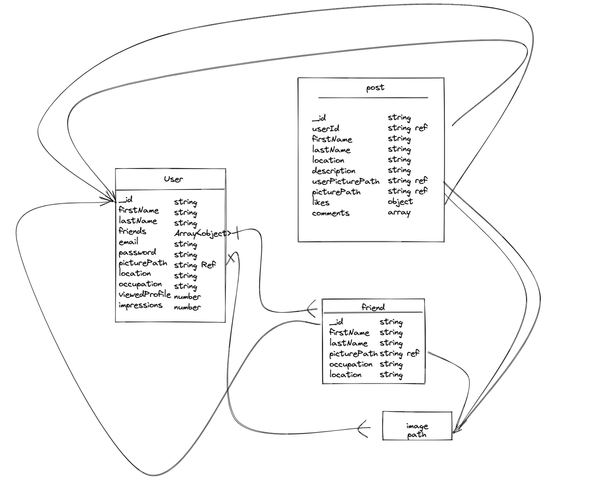

# HeavenStar

## 📅 프로젝트 기간

## 🏁 프로젝트 실행 방법

## 개발 환경

## 스키마



## 🔧 기술 스택

| 사용 기술 | 기술 채택 근거 |
| --------- | -------------- | --- |
|           |                |
|           |                |     |
|           |                |

## 📏 스스로의 규칙

### git commit --prefix

```
[feat] 기능 추가, 삭제, 변경 - 코드 수정 발생 시
[fix] 버그 수정 - 코드 수정 발생 시
[design] CSS등 사용자 UI 디자인 변경 - 코드 수정 발생 시
[docs] 문서 추가, 삭제, 변경 - 코드 수정 없음
[style] 코드 형식, 정렬, 주석등의 변경, ex) 세미콜론 추가 - 코드 수정 발생 시 (동작에 영향 없음)
[refactor] 코드 리팩토링 ex) renaming a variable - 코드 수정 발생 시
[chore] 패키지 매니저 설정, yarn 모듈 설치 등 - 코드 수정 없음
[etc] 위에 해당하지 않는 모든 변경 ex) 빌드 스크립트 수정, 패키지 배포 설정 변경 - 코드 수정 없음
[rename] 파일 혹은 폴더명을 수정하거나 옮기는 작업만인 경우 - 코드 수정 없음
[remove] 파일을 삭제하는 작업만 수행한 경우 - 코드 수정 없음
[setting] 폴더/설정 추가,삭제 - 코드 수정 없음
```
